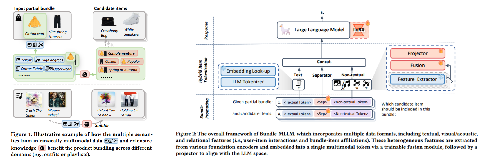

<div align=center>

<h1>Fine-tuning Multimodal Large Language Models for Product Bundling</h1>

<h5 align="center">


[](https://arxiv.org/abs/2407.11712)


</h5>

<div>
      <a href="mailto:xiaohao.liu@u.nus.edu">Xiaohao Liu</a><sup>1</sup>,
      <a href="mailto:wujie@cuc.edu.cn">Jie Wu</a><sup>2</sup>,
      <a href="mailto:taozhulin@gmail.com">Zhulin Tao</a><sup>2</sup><sup>*</sup>,
      <a href="mailto:yunshan.ma@u.nus.edu">Yunshan Ma</a><sup>1</sup>,
      <a href="mailto:yinewei.wei@hotmail.com">Yinwei Wei</a><sup>3</sup>,
      <a href="mailto:dcscts@nus.edu.sg">Tat-seng Chua</a><sup>1</sup>
</div>

<div>
  <sup>1</sup>National University of Singapore, 
  <sup>2</sup>Communication University of China, 
  <sup>3</sup>Shandong University
</div>   
<div>
<sup>*</sup>Corresponding author.
   </div>

</div>


# Bundle-MLLM

This repository contains the code for the paper "Fine-tuning Multimodal Large Language Models for Product Bundling."

We introduce Bundle-MLLM, a novel approach that bridges the gap between Large Language Models (LLMs) and product bundling tasks. Bundle-MLLM uses hybrid item tokenization to integrate multimodal information through a fusion module and a trainable projector that embeds non-textual features into a single token.

Our progressive optimization strategy fine-tunes the LLMs for disentangled objectives, achieving effective product bundling with comprehensive multimodal understanding.



## 👉 Quick start

### Dependencies


To train and infer for Bundle-MLLM, we use the following libraries: `fastchat`, `transformers`, and `torch`. You can install these dependencies using the following pip commands:

```
pip install fastchat transformers torch
```

Our experiments were conducted on a server with 4 * A40 GPUs and with CUDA Version 12.2.

### Dataset downloading

The datasets used in our paper can be downloaded from [this link](https://huggingface.co/datasets/xhLiu/BundleConstruction). The download includes the following four datasets: `POG_sparse`, `Spotify_sparse`, `pog`, and `spotify`. All four datasets were utilized in our experiments.

After downloading and extracting the datasets, place them in the `datasets` directory. You can specify which dataset to use during runtime with the `--dataset` argument and set the data path using `--data_path`. The default dataset is `pog`.

### Train and Test

The training and testing processes for Bundle-MLLM are managed through the `main.py` script.

To run the training/testing process, use the following command:

```
python main.py -o {train|test} -d {dataset} -m {text|text+mm} --soft_prompt={True|False} --del_sp={True|False} -p {checkpoint_path}
```


Below is an example of how to train Bundle-MLLM in two stages:

1. **Training Stage 1: Initial Training**

   First, run the following command to start the initial training phase:

   ```bash
   python main.py -d pog -o train -m text -i test_sample_num_64 --soft_prompt=True --toy_eval=256 --few_shot=1024 
   ```

2. **Training Stage 2: Progressive Optimization**

   After completing Stage 1, run the following command for the second training stage:

   ```bash
   python main.py -d pog -o train -m text+mm_20 -i fuse_soft_prompt_del --soft_prompt=True --del_sp=True --toy_eval=256 --num_cans=20 -p {checkpoint_path}
   ```

3. **Test**

   Once the training is complete, you can run the same Stage 2 command again if needed:

   ```bash
   python main.py -d pog -o test -m text+mm_20 -i fuse_soft_prompt_del --soft_prompt=True --del_sp=True --toy_eval=256 --num_cans=20 -p  {checkpoint_path}
   ```


These settings can be adjusted in the script to fit your specific requirements.


## ☎️ Contact

Please contact the author of this paper for queries.

- **Xiaohao Liu**, [xiaohao.liu@u.nus.edu](mailto:xiaohao.liu@u.nus.edu)

## 🌟 Citation

If you find our work helpful, please cite it as follows:

```bibtex
@article{liu2025finetuning,
  title={Fine-tuning Multimodal Large Language Models for Product Bundling},
  author={Liu, Xiaohao and Wu, Jie and Tao, Zhulin and Ma, Yunshan and Wei, Yinwei and Chua, Tat-seng},
  booktitle={{KDD}},
  year={2025}
}
```
